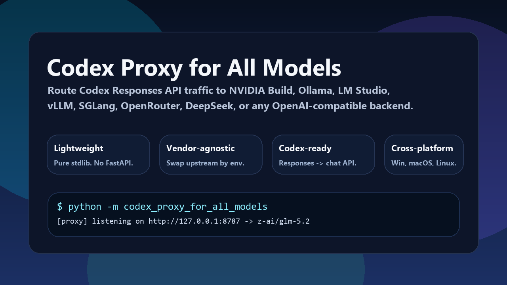
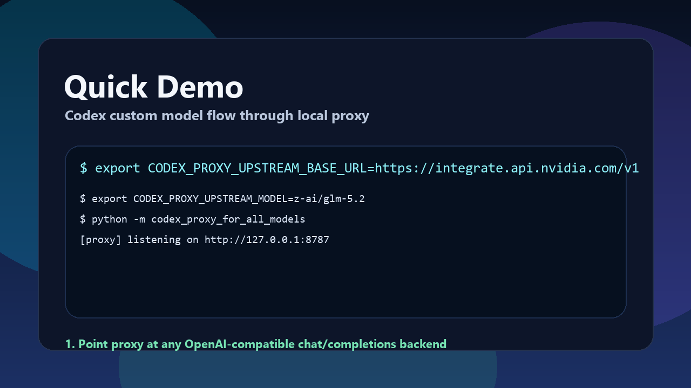

# Codex Proxy for All Models

[](https://github.com/kyoo-147/codex_proxy_for_all_models/actions/workflows/ci.yml)
[](https://pypi.org/project/codex-proxy-for-all-models/)
[](LICENSE)

**Codex-first lightweight model bridge for NVIDIA NIM and other OpenAI-compatible backends.**





This project is for people who like the Codex app and Codex CLI workflow, but want to route requests to other models.

- NVIDIA Build models like `z-ai/glm-5.2`, `moonshotai/kimi-k2.6`, `qwen/qwen3-*`, `deepseek-*`
- Ollama local models such as `qwen3:8b`, `llama3.1`, `glm4`, `deepseek-r1`
- LM Studio local servers
- vLLM deployments
- SGLang deployments
- OpenRouter hosted models
- DeepSeek or any other provider exposing an OpenAI-compatible `chat/completions` API

## Pool mode (v0.2+)

The proxy can run in **pool mode** with three curated Codex profiles:

| Profile | Display name | Use case |
|---|---|---|
| `codex-fast` | Codex Fast | Low-latency coding tasks |
| `codex-balanced` | Codex Balanced | Default daily work, free-first |
| `codex-strong` | Codex Strong | Harder multi-file, tool-heavy sessions |

Pool mode adds automatic failover, multi-key rotation, and cooldown.

Enable with a `CODEX_PROXY_CONFIG_PATH` pointing to a TOML pool config:

```toml
mode = "pool"

[profiles."codex-balanced"]
visible_slug = "codex-balanced"
display_name = "Codex Balanced"
pool_order = ["cheap_free", "coding_fast"]
```

[Full pool config example](config-examples/codex-pool.toml)

Codex sees only the three curated models. The router handles failover transparently.

## Why this repo exists

Codex works best with the Responses API. Many non-OpenAI providers expose only `chat/completions`, or expose Responses-incompatible metadata. This proxy sits in the middle:

`Codex -> Responses API -> this proxy -> chat/completions upstream`

That gives you:

- Codex app and Codex CLI workflow
- lightweight local bridge
- one proxy for many providers
- freedom to swap upstreams without changing your daily Codex habits

## Key strengths

- Zero runtime dependencies. Pure Python standard library.
- Lightweight. One small HTTP process, no framework, no database, no Node.
- Vendor-agnostic. Switch upstream by changing environment variables, not code.
- Codex-focused. Returns Codex-friendly `/responses` and `/models` payloads.
- Cross-platform. Works on Windows, macOS, and Linux.
- Easy SEO/discovery. Covers Codex + NVIDIA + Ollama + LM Studio + vLLM + SGLang in one place.

## What it supports

- `GET /health`
- `GET /models`
- `GET /v1/models`
- `POST /responses`
- `POST /v1/responses`
- `POST /chat/completions`
- `POST /v1/chat/completions`

## Architecture

```text
Codex app / CLI
        |
        v
Responses API payload
        |
        v
Codex Proxy for All Models
        |
        v
OpenAI-compatible chat/completions upstream
```

The proxy handles:

- request translation from Responses to chat-completions
- tool definition translation
- model catalog payloads for Codex
- light provider metadata for Codex model discovery

> **Note:** This proxy is non-streaming only. All requests are proxied as blocking HTTP calls.

## Quick demo

1. Point Codex at `http://127.0.0.1:8787` with `wire_api = "responses"`.
2. Start proxy with env vars for any OpenAI-compatible `chat/completions` backend.
3. Keep Codex UX while switching backend models freely.

## Quick start

### 1. Clone

```bash
git clone https://github.com/kyoo-147/codex_proxy_for_all_models.git
cd codex_proxy_for_all_models
```

### 2. Set upstream variables

Linux/macOS:

```bash
export CODEX_PROXY_UPSTREAM_BASE_URL="https://integrate.api.nvidia.com/v1"
export CODEX_PROXY_UPSTREAM_API_KEY="your_key"
export CODEX_PROXY_UPSTREAM_MODEL="z-ai/glm-5.2"
export CODEX_PROXY_PROVIDER_LABEL="NVIDIA Build"
```

Windows PowerShell:

```powershell
$env:CODEX_PROXY_UPSTREAM_BASE_URL = "https://integrate.api.nvidia.com/v1"
$env:CODEX_PROXY_UPSTREAM_API_KEY = "your_key"
$env:CODEX_PROXY_UPSTREAM_MODEL = "z-ai/glm-5.2"
$env:CODEX_PROXY_PROVIDER_LABEL = "NVIDIA Build"
```

### 3. Start proxy

```bash
python -m codex_proxy_for_all_models
```

Default listen address:

- `http://127.0.0.1:8787`

Helper wrappers:

- `scripts/codex-proxy.sh`
- `scripts/codex-proxy.bat`

### 4. Point Codex at the proxy

Add this to `~/.codex/config.toml`:

```toml
model = "z-ai/glm-5.2"
model_provider = "local_model_proxy"

[model_providers.local_model_proxy]
name = "Local Model Proxy"
base_url = "http://127.0.0.1:8787"
wire_api = "responses"
env_key = "DUMMY_API_KEY"
```

Set placeholder key so Codex is satisfied:

Linux/macOS:

```bash
export DUMMY_API_KEY=dummy
```

Windows PowerShell:

```powershell
$env:DUMMY_API_KEY = "dummy"
```

Then launch Codex:

```bash
codex
```

## NVIDIA Build setup

NVIDIA Build exposes many OpenAI-compatible model endpoints. Browse models here:

- [NVIDIA Build model catalog](https://build.nvidia.com/models)

Example:

```bash
export CODEX_PROXY_UPSTREAM_BASE_URL="https://integrate.api.nvidia.com/v1"
export CODEX_PROXY_UPSTREAM_API_KEY="your_nvidia_key"
export CODEX_PROXY_UPSTREAM_MODEL="z-ai/glm-5.2"
export CODEX_PROXY_PROVIDER_LABEL="NVIDIA Build"
python -m codex_proxy_for_all_models
```

Other NVIDIA Build models can often be swapped by changing only:

- `CODEX_PROXY_UPSTREAM_MODEL`

Examples worth trying:

- `z-ai/glm-5.2`
- `moonshotai/kimi-k2.6`
- `qwen/qwen3-next-80b-a3b-instruct`
- `deepseek-ai/deepseek-v4-pro`
- `deepseek-ai/deepseek-v4-flash`

## Ollama setup

```bash
export CODEX_PROXY_UPSTREAM_BASE_URL="http://127.0.0.1:11434/v1"
export CODEX_PROXY_UPSTREAM_API_KEY="ollama"
export CODEX_PROXY_UPSTREAM_MODEL="qwen3:8b"
export CODEX_PROXY_PROVIDER_LABEL="Ollama"
python -m codex_proxy_for_all_models
```

## LM Studio setup

```bash
export CODEX_PROXY_UPSTREAM_BASE_URL="http://127.0.0.1:1234/v1"
export CODEX_PROXY_UPSTREAM_API_KEY="lmstudio"
export CODEX_PROXY_UPSTREAM_MODEL="local-model"
export CODEX_PROXY_PROVIDER_LABEL="LM Studio"
python -m codex_proxy_for_all_models
```

## vLLM setup

```bash
export CODEX_PROXY_UPSTREAM_BASE_URL="http://127.0.0.1:8000/v1"
export CODEX_PROXY_UPSTREAM_API_KEY="token"
export CODEX_PROXY_UPSTREAM_MODEL="Qwen/Qwen3-32B"
export CODEX_PROXY_PROVIDER_LABEL="vLLM"
python -m codex_proxy_for_all_models
```

## SGLang setup

```bash
export CODEX_PROXY_UPSTREAM_BASE_URL="http://127.0.0.1:30000/v1"
export CODEX_PROXY_UPSTREAM_API_KEY="token"
export CODEX_PROXY_UPSTREAM_MODEL="deepseek-ai/DeepSeek-V3"
export CODEX_PROXY_PROVIDER_LABEL="SGLang"
python -m codex_proxy_for_all_models
```

## OpenRouter setup

```bash
export CODEX_PROXY_UPSTREAM_BASE_URL="https://openrouter.ai/api/v1"
export CODEX_PROXY_UPSTREAM_API_KEY="your_openrouter_key"
export CODEX_PROXY_UPSTREAM_MODEL="z-ai/glm-5.2"
export CODEX_PROXY_PROVIDER_LABEL="OpenRouter"
export CODEX_PROXY_EXTRA_HEADERS='{"HTTP-Referer":"https://github.com/kyoo-147/codex_proxy_for_all_models","X-Title":"Codex Proxy for All Models"}'
python -m codex_proxy_for_all_models
```

## Repository layout

```text
.
|- .github/workflows/ci.yml
|- assets/
|- config-examples/
|- docs/
|- scripts/
|- src/codex_proxy_for_all_models/
|- tests/
|- codex_proxy_for_all_models.py
|- glm_proxy.py
|- pyproject.toml
`- README.md
```

## Tests

Run:

```bash
python -m unittest discover -s tests -v
```

Current coverage in this repo verifies:

- config loading
- request mapping
- response mapping
- local fake-upstream integration
- `/health`, `/models`, `/responses`

README media can be regenerated with:

```bash
python scripts/generate_readme_media.py
```

## Lightweight by design

Compared with heavier proxy stacks, this repo stays small on purpose:

- no FastAPI
- no Flask
- no uvicorn
- no pydantic
- no Node
- no database
- no container required

That makes it easy to audit, easy to fork, and easy to run on small local machines.

## Known limitations

- Upstream rate limits still apply. Proxy cannot fix `429`.
- Some providers expose incomplete tool-calling behavior.
- Some providers stream differently; text mode is more reliable than long tool-heavy sessions on weak upstreams.
- Codex app UI may show `Custom` instead of your exact upstream name. That is a Codex UI behavior, not always a proxy bug.

## Docs

- [Codex setup](docs/codex-setup.md)
- [NVIDIA pool setups](docs/nvidia-pools.md)
- [Provider guide](docs/providers.md)
- [Architecture notes](docs/architecture.md)
- [Troubleshooting](docs/troubleshooting.md)
- [Publishing](docs/publishing.md)

## License

MIT
